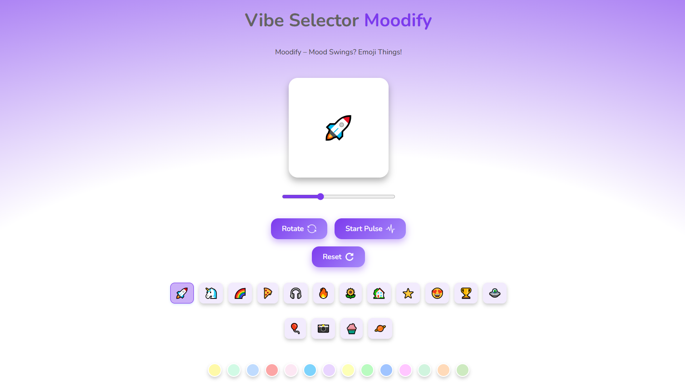

# Moodify - The Emoji Editor 🎉

[🌐 Visit Moodify](https://moodify-emoji-editor.netlify.app)

Moodify is a fun and interactive emoji playground built with React. Explore emoji switching, color backgrounds, and animated effects — all powered by the `useState` hook.

---

## 🚀 Features

- 🔁 Emoji selector
- 🎨 Background color palette
- 📏 Emoji size slider
- 🔄 Rotate & pulse animations
- 🧼 Reset button with toast

## 🛠 Tech Stack

- React (Hooks: `useState`)
- CSS Modules
- React-hot-toast

---

📌 Github - https://github.com/Shravanikuldharan/Moodify